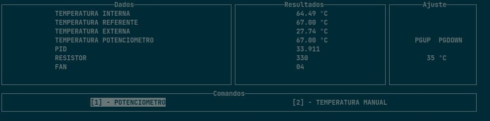

## Projeto 1 - 2020/2 - FSE

|Matrícula | Aluno |
| -- | -- |
| 15/0135521 |  Leonardo dos S. S. Barreiros |


## Objetivo

Este trabalho tem por objetivo a implementação de um sistema de controle de temperatura, em que, através de uma Raspberry pi 4 realizamos toda a comunicação e elaboração de um ambiente controlado. Neste ambiente controlado possuimos os seguintes sensores:

- 01 Sensor LM35 para a medição da temperatura interna (TI) do ambiente controlado;
- 01 Sensor BME280 (I2C) para a medição da temperatura externa (TE);
- 01 módulo Display LCD 16x2 com circuito I2C integrado (Controlador HD44780);
- 01 Conversor lógico bidirecional (3.3V / 5V);
- Circuito de potência com 2 relés;
- 01 Arduino Micro;
- Potenciômetro para regular qual a temperatura referencial a ser obtida;
- Raspberry Pi 4;

## Dos requisitos do trabalho

- Possui um menu interativo, onde o usuário pode acompanhar as temperaturas que são solicitadas, além de poder alternar entre usar temperatura pelo potenciomentro e uma temperatura manual;
- Realiza leitura da temperatura interna;
- Realiza leitura da temperatura ambiente;
- Realiza leitura da temperatura Potenciômentro;
- Realiza leitura de temperaturas através do controlador PID;
- Realiza a escrita e atualização de dados no Display LCD;
- Realiza o armazenamento dos dados em um arquivo CSV - nomeado como __temperature_control.csv__;
- Código Modularizado;

## Compilação

Para compilar o trabalho, através do terminal e na raiz do repositório execute o comando:

```sh
$ make all
```
Assim será realizado a compilação das bibliotecas e scripts do trabalho.

Em seguida para rodar o trabalho, rode o seguinte comando:

```sh
$ make run
```
E então será aberto o menu interativo.

### Utilização



O menu possui 4 áreas:

Em Dados a parte de leitura onde irá mostrar as labels de temperaturas e solicitações.

Em Resultados é mostrado todos os valores aferidos.

Em ajuste temos as labels de pgUp e pgDown que são funções para ajustar a temperatura referencial, quando está no modo __TEMPERATURA MANUAL__.

Em comandos tempos duas opções que podem ser escolhidas pelas arrow keys(setas) do seu teclado direita ou esquerda, para alternar entre __POTENCIÔMETRO__ e __TEMPERATURA MANUAL__.

É importante observar que a temperatura referencial somente irá mudar se estiver com o comando __TEMPERATURA MANUAL__ acionado, e para isto acontecer basta apertar a seta para __direita__. Caso contrario não irá funcionar.


A temperatura referencial é limitada entre a __temperatura ambiente__ como sendo esta a menor possível e a a temperatura máxima de __99 ºC__. E para ajustar a temperatura bastar usar as __setas__ para cima para __aumentar__ e para __baixo__ para diminuir.


O programa foi divido em duas threads, a thread principal que executa as atualizações dos dados, e a secundaria que executa o menu. Dentro da que executa a atualização dos dados, enquanto os dados são validados e atualizados ao final da execução é feito a escrita em um arquivo csv, nomeado como __temperature control.csv__. Toda vez que um dado valido é solicitado este mesmo será escrito neste arquivo.

Dentro do csv encontramos a seguinte estrutura:

- timestamp: para registrar a data em formato DD-MM-AAAA HH:MM:SS;
- Temperatura Interna: registro da temperatura interna solicitada; 
- Temperatura Referencial: registro da temperatura referencial solicitada; 
- Temperatura Externa: registro da temperatura externa solicitada; 
- Ventoinha: registro da intensidade da ventoinha de acordo com o pid; 
- resistor: registro da intensidade do resistor de acordo com o pid;


Para encerrar o programa, apenas aperte __ctrl+c__. O programa irá receber o sinal sigint e executar a função __cancelProcess__,
que irá desligar a ventoinha, o resistor, limpar o display LCD, fechar a uart, desligar o sensor BME e por ultimo finalizar a execução do programa, tudo nesta ordem. 

## Dos Resultados

Título: Temperaturas x tempo (onde td veio do potenciômetro nesse gráfico):

Legendas
- TI = __Temperatura interna__, em ºC;
- TE = __Temperatura externa__, em ºC;
- TR = __Temperatura definida pelo usuário__ (potenciômetro ou manual), em ºC;


Título: Resistor & ventoínha x tempo

Legendas: 
- FAN = Valor de acionamento da __ventoínha__, em percentagem;
- RES = Valor de acionamento do __resistor__, em percentagem.

